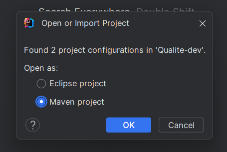
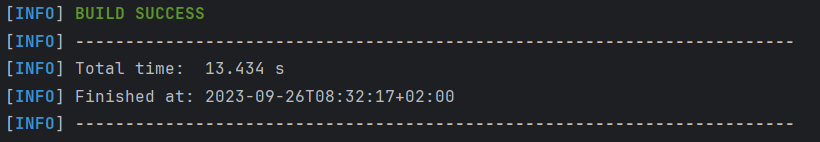
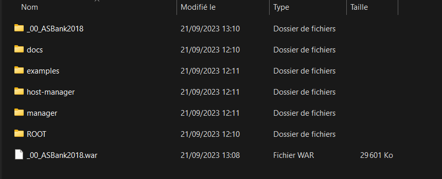
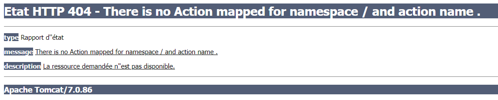
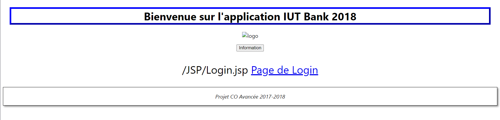

# Semaine 38

### Déploiement de l'application (en cours)

Lors de la réception des sources du projet, la première étape a été de les importer dans l'IDE. Nous avons choisi IntelliJ, puis sélectionné l'option "Maven project".

Suite à cela, nous avons tenté de construire le projet en utilisant la commande `mvn clean install`. Cependant, nous avons rencontré 39 erreurs provenant des tests. Il est possible de construire le projet sans exécuter les tests en ajoutant l'option suivante à la commande : `mvn clean install -DskipTests`. Cette commande génère un fichier {nom_projet}.war dans le dossier "target" à la racine du projet.

Avec ce fichier war, nous avons essayé de lancer l'application (théoriquement) en le plaçant dans le dossier "webapps" de Tomcat, puis en lançant le serveur.

Les premières difficultés sont apparues à ce stade. En effet, en accédant à Tomcat via "localhost:8080/{nom_projet}", nous avons été redirigés vers une page d'erreur 404 avec le message "no Action mapped for namespace '/' and action.". Nous avons supposé que cette erreur devait provenir de Struts.

Il était possible d'accéder aux différents fichiers JSP du projet sans avoir les contrôleurs et l'ORM en modifiant la structure du dossier généré par Tomcat. En effet, le fichier war est décompressé et crée un dossier avec deux sous-dossiers, "WEB-INF" et "META-INF". En examinant le contenu de "WEB-INF", nous avons trouvé les différents fichiers de l'application, y compris les fichiers JS, JSP et CSS. En déplaçant ces dossiers à la racine, il était possible d'accéder aux différentes vues.

Mais maintenant nous sommes bloqué depuis presque 5 jours sans aucunes avancées sur le déploiement.

#### Update deploiement

J'ai réussi à déployer l'application complètement.

Il a fallu déplacer certains dossiers dans les sources.

Tout d'abord, les dossiers JSP, JS, style, META-INF et WEB-INF, qui se trouvaient dans src/main/webapps, doivent maintenant être situés dans le dossier WebContent à la racine des sources.

Le fichier struts.xml a également dû être déplacé à la racine du dossier src.

Suite à ces modifications, l'application se lance correctement, mais il reste à configurer la base de données.

J'ai créé un serveur avec XAMPP, importé le dump de la base de données, et modifié le fichier applicationContext.xml en y ajoutant mes informations de connexion.

Et l'application fonctionne maintenant parfaitement !

### Base de données

En ce qui touche à la base de données, suite à une analyse approfondie, il a été constaté que les données relatives aux utilisateurs et aux comptes présentent des incohérences notables, voire des lacunes. Par conséquent, plusieurs modifications et ajouts d'attributs seront apportés à chaque table.

Il est à noter qu'un jeu d'essai plus représentatif est actuellement en cours de production.

# Semaine 39

### Tests 

Afin de faire fonctionner les tests, il a seulement fallu importer la base de données de tests et adapter les chaines de connexions dans les fichier TestsBanquesManager-context.xml et TestsDaoHibernate-context.xml.

### Upgrade des versions 

Une branche versions_upgrade a été créée pour commencer à mettre à jour les plugins et dépendances du projet. Les mises à jours aux dans les dernières versions qui passent les tests ont été commits, cependant  certaines dépendances comme spring (à partir de la v6) vont nécessiter des changements dans le code afin de pouvoir refaire fonctionner le projet.
